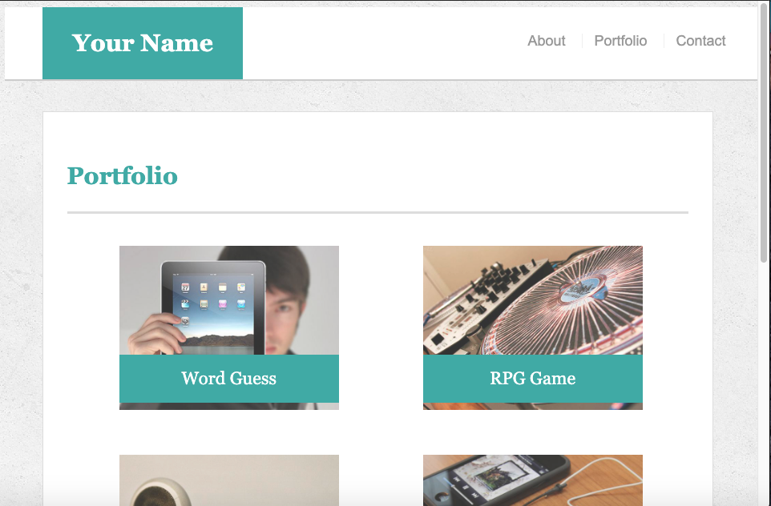
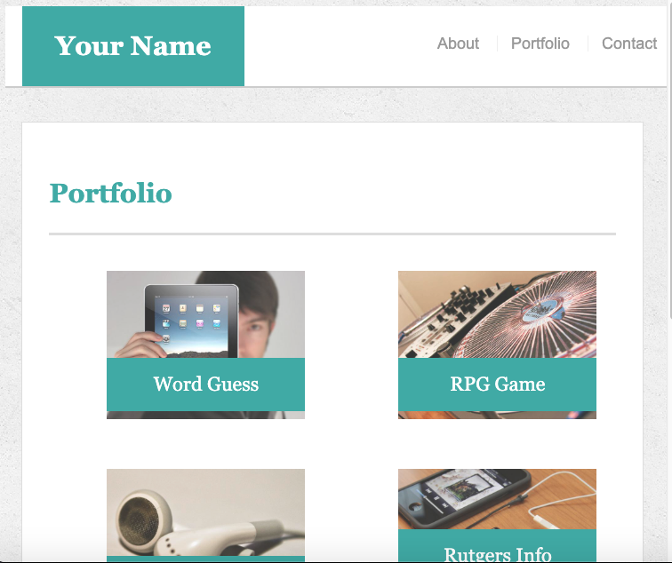
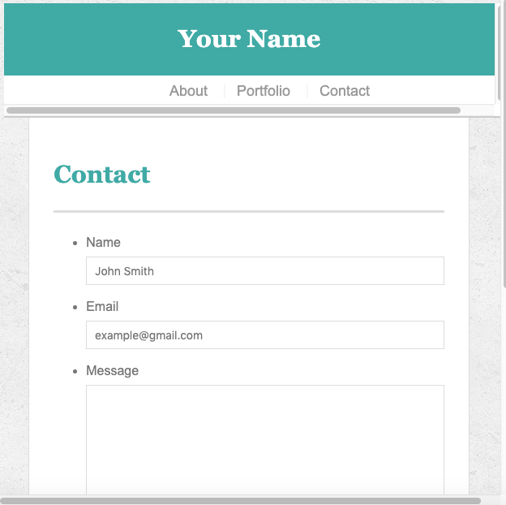

# Responsive-Portfolio
___

The Responsive-Portfolio assignment required the use of media queries at pixel sizing of 980px, 768px, and 640px to maintain proper formatting at smaller viewport sizes. The first step in the process was adding meta tags in the html files with viewport settings. Next @media tags were added to the css at the specified pixel sizes. To maintain formatting/padding around content the container width was adjusted accordingly to meet the specifications of the assignment. At 960px and 768px the .work div for portfolio images was adjusted at the left margin and width to justify center. At 640px the header position was made static, the logo class id was padded 100% to center text, and transform on the x and y axis was utilized to arrange the header above the nav bar. The image contained within the div class auth-image on index.html was expanded by width 100%. The images within the .work id were expanded by 100% width at 640px to match formatting.

## Built With

___

* HTML
* CSS

___

##Index:

___

##Portfolio:

___

##Contact:

